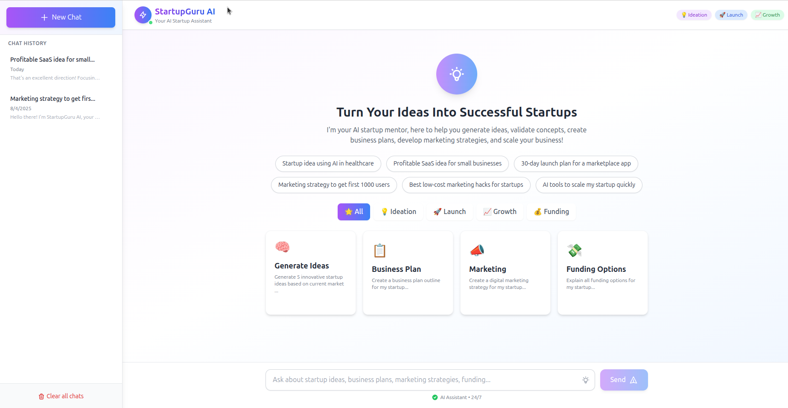
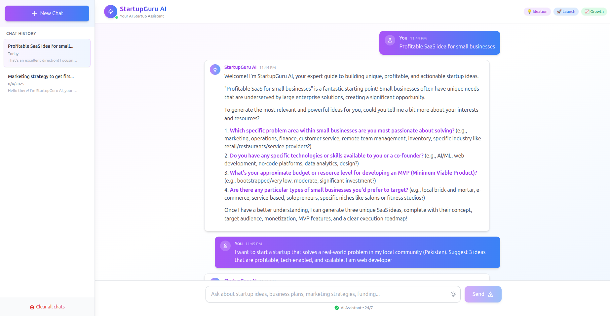

# StartupGuru AI Chatbot

Turn Your Ideas Into Successful Startups 🚀

StartupGuru AI is your AI-powered startup mentor, designed to help you generate ideas, validate concepts, create business plans, develop marketing strategies, and scale your business. This project consists of a modern frontend (React + Vite + Tailwind CSS) and a Node.js backend.

---

## Live Demo

The chatbot is live here: [https://startupguru-ai-chatbot.vercel.app/](https://startupguru-ai-chatbot.vercel.app/)

---

## Table of Contents
- [Features](#features)
- [Folder Structure](#folder-structure)
- [Frontend (client)](#frontend-client)
- [Backend (server)](#backend-server)
- [Requirements](#requirements)
- [Screenshots](#screenshots)
- [License](#license)

---

---

## Features
- AI-powered startup ideation and mentoring
- Business plan generation
- Marketing strategy suggestions
- Funding options guidance
- Clean, modern UI (see screenshots below)

- Chat-based interface for interactive Q&A
- Predefined prompts for quick startup advice
- Categorized suggestions (Ideation, Launch, Growth, Funding)
- Responsive design for desktop and mobile

---

## Folder Structure
```
ui.png
ui2.png
client/
    eslint.config.js
    index.html
    package.json
    postcss.config.js
    tailwind.config.js
    tsconfig.app.json
    tsconfig.json
    tsconfig.node.json
    vite.config.ts
    assets/
        logo.png
    src/
        App.tsx
        index.css
        main.tsx
        vite-env.d.ts
        components/
            ChatBox.jsx
        hooks/
            useChat.ts
        services/
            chatService.ts
server/
    index.js
    package.json
    vercel.json
```

---

---

## Frontend (client)
- **Framework:** React (with TypeScript)
- **Build Tool:** Vite
- **Styling:** Tailwind CSS
- **Linting:** ESLint

The frontend provides a modern, responsive UI for interacting with the AI assistant. It uses React functional components, hooks, and Tailwind CSS for styling. The chat interface supports both free-form and prompt-based queries.

#### Key Files
- `src/App.tsx`: Main app component
- `src/components/ChatBox.jsx`: Chat UI logic
- `src/services/chatService.ts`: Handles API calls to backend

### Getting Started
```bash
cd client
npm install
npm run dev
```

---

## Backend (server)
- **Runtime:** Node.js
- **API:** Express (or similar, see `server/index.js`)

The backend exposes RESTful endpoints to process chat messages and interact with the AI model. It is designed for easy deployment (e.g., Vercel) and can be extended to support authentication, analytics, or database integration.

#### Key Files
- `index.js`: Main server logic and API routes
- `vercel.json`: Deployment configuration

### Getting Started
```bash
cd server
npm install
node index.js
```

---


## Requirements
- Node.js (v16+ recommended)
- npm

---

## Installation

1. **Clone the repository:**
   ```bash
   git clone <repo-url>
   cd Startup-idea-chatbot
   ```
2. **Install dependencies for frontend and backend:**
   ```bash
   cd client && npm install
   cd ../server && npm install
   ```
3. **Run the apps:**
   - Frontend: `npm run dev` (in `client`)
   - Backend: `node index.js` (in `server`)

---

## Configuration

Before running the backend, you must set your Gemini API key:

1. Create a `.env` file inside the `server/` directory.
2. Add the following line, replacing `YOUR_GEMINI_API_KEY` with your actual Gemini API key:
   ```env
   GEMINI_API_KEY=YOUR_GEMINI_API_KEY
   ```
3. Make sure your backend code loads this environment variable (see `server/index.js`).

> **Note:** If you deploy to Vercel or another cloud provider, set the `GEMINI_API_KEY` in your project environment variables dashboard.

Other configuration (if needed):
- Update API endpoints in the frontend (`client/src/services/chatService.ts`) if your backend runs on a different URL or port.

---

## Screenshots

### Main UI


### Chat-Bot-Response


---

## License
MIT
---

<p align="center">Made with ❤️ by Ahmad Bajwa</p>
